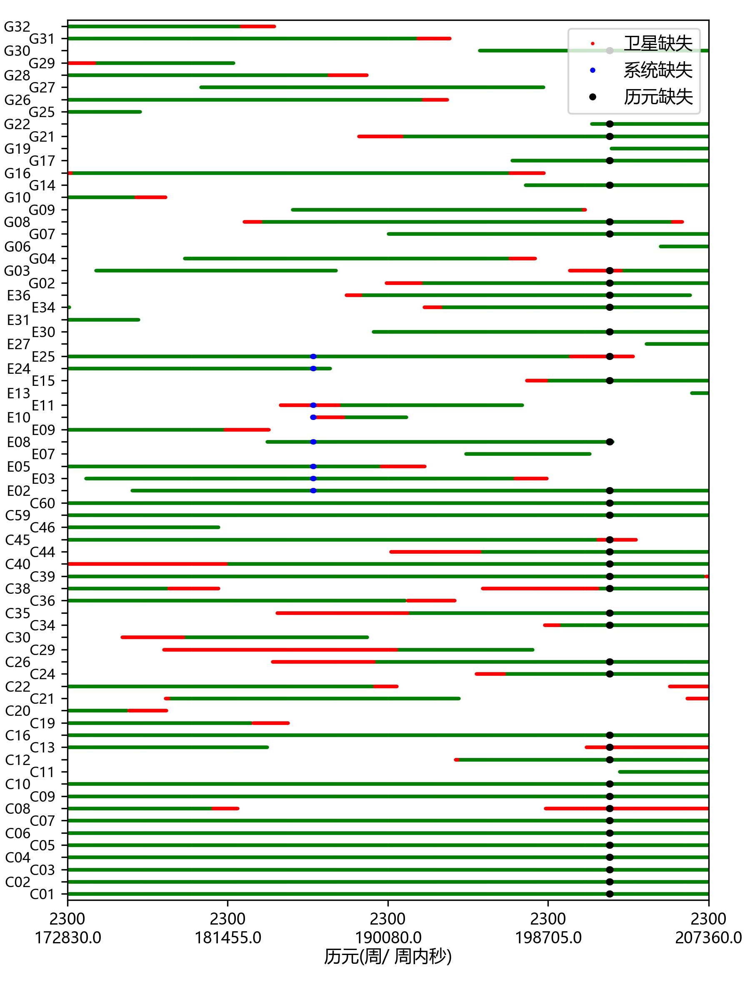

# GNSS数据质量评估软件  GNSSDataQC
### 代码将在文章录用后上传
## 使用方法
配置ini.json文件后双击打开即可运行，并自动画图
```json5
[
    {
        //*为必填项
        "obs_path": "./JZ010370.24O",//观测数据路径*
        "nav_path": "./JZ010370.24P",//导航数据路径*
        "xyz": "-2413158.1982,5375431.9498,2433925.5602",//坐标*
        "ele_inv": 1,//星空图统计完整率等的分割值，单位°，默认为30
        "azi_inv": 1,//星空图统计完整率等的分割值
        "ele_cut": 10,//截止高度角，默认15
        "sys": "GCE", 
        "otherSys":"GC,GE",//在统计单个系统及所有系统的基础上额外的组合
        "nf":2, // 1:单频 2：双频,默认双频
        "inv":30 //采样间隔，默认根据文件确认，单位秒
    },
    {
        "obs_path": "./DB010370.24O",
        "nav_path": "./DB010370.24P",
        "xyz": "-2413174.7060,5375288.8260,2434169.2673",
        "ele_inv": 1,
        "azi_inv": 1,
        "ele_cut": 10,
        "sys": "GCE"
    }
]
```
## 画图配置
### 调用方法plotGQC.exe arg1 arg2...
#### PATH:./A.GQC
文件路径
#### DIR:./
文件夹路径，默认自动读取文件夹下所有的
#### SATSUM:1
是否画每颗卫星的完整率图，默认1
#### EPOCH:1 
是否画历元统计信息，默认1
#### DOPS:1 
是否画卫星数及DOPs变化图，默认1
#### OPT:1 
是否再右下角添加截止高度角信息，默认0
#### SYSSUM:1
是否画卫星系统统计完整率等信息，默认1
#### SKYSUM:1 
是否画完整率、平均多路径等空间分布图，默认1
#### SKY:1 
是否画卫星时段图、卫星信噪比和多路径分布图，默认1
#### RMGAP:0 
是否当当前历元卫星数据缺失时不统计DOPs值等信息，默认0；主要是为了避免多次缺失导DOPs偏大
# 试例结果
#### 卫星时段图

#### 卫星DOPs和卫星数图

#### 多路径与周跳时段图

#### 卫星汇总图

#### 系统汇总图

#### 数据空间完整率分布图
